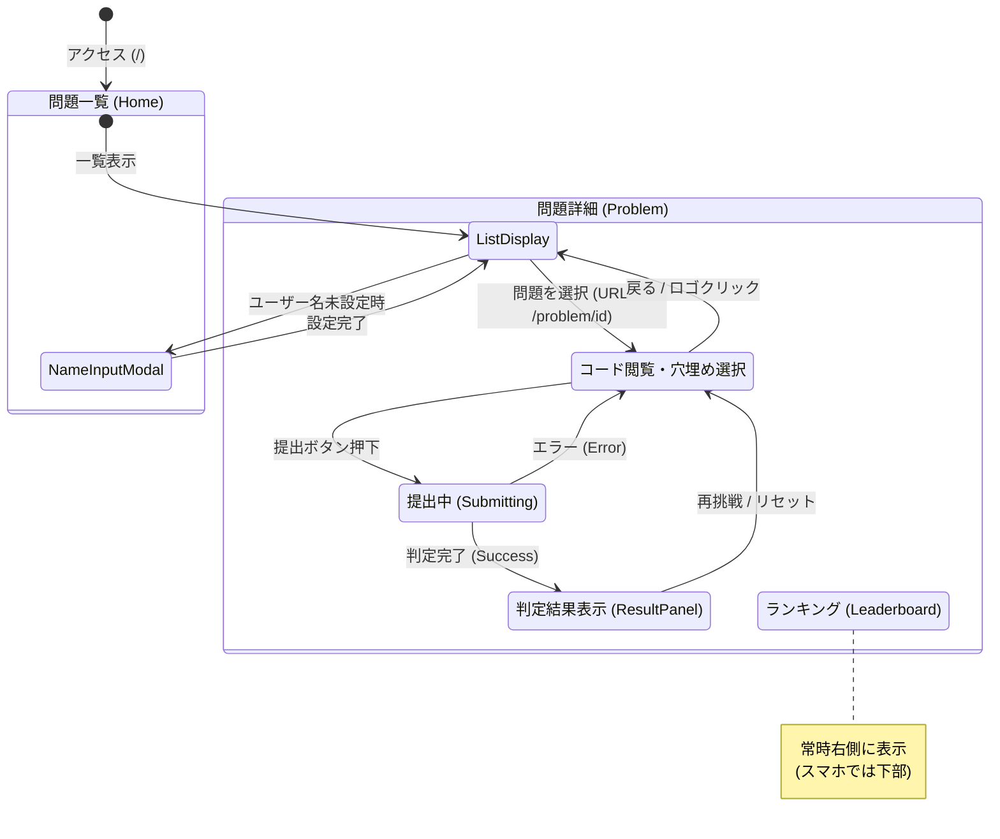
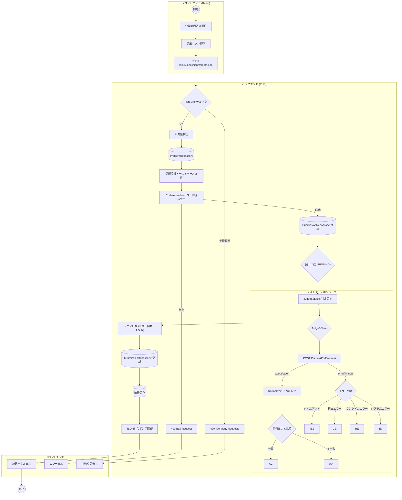
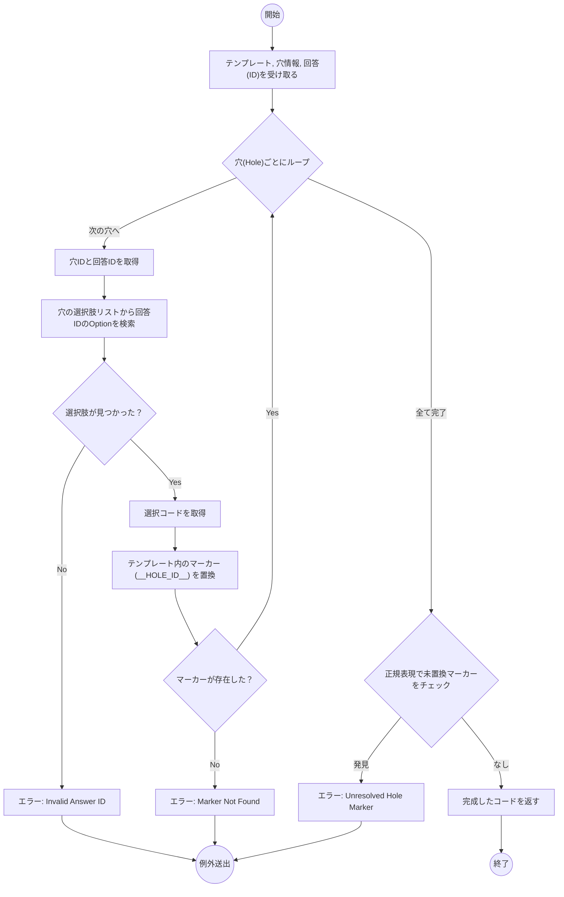
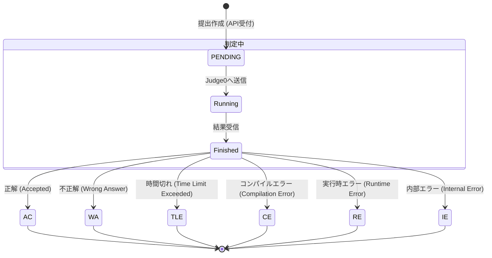
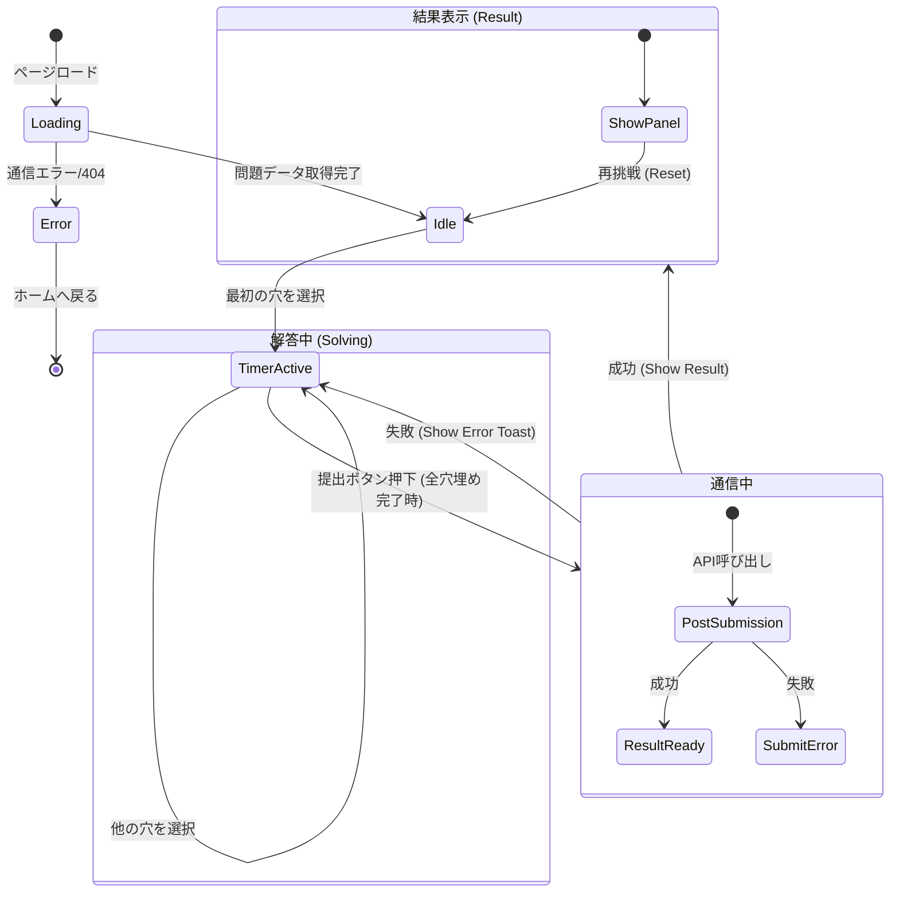
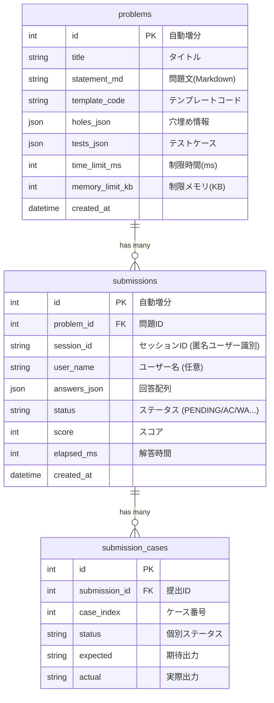
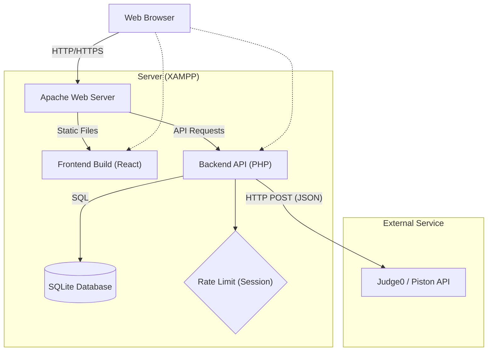
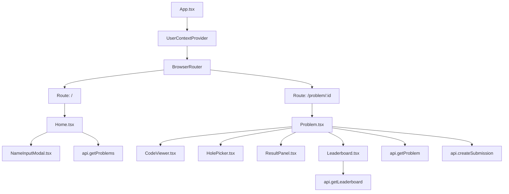

# システム図 (System Diagrams)

## ページ遷移図

**[図の読み方]**
アプリケーションの画面遷移を表しています。トップページは「問題一覧」で、ここから各「問題詳細」画面へ遷移します。
問題詳細画面では、コードの穴埋め作業（Filling）を行い、「提出」を行うとAPI通信中の状態（Submitting）を経て、判定結果（Result）が表示されます。
ランキング（Leaderboard）は問題詳細画面内に配置されており、提出完了時などに更新されます。ユーザー名は初回アクセス時または変更時にモーダルで入力します。

## 実行・判定フローチャート

**[図の読み方]**
ユーザーが「提出」を行ってから結果が表示されるまでの処理フローです。
フロントエンドから送信された回答IDは、バックエンドでテンプレートコードと結合され、実行可能なPythonコードになります。
その後、Piston API (Judge0Client) を通じてコードが実行され、その出力が期待値と比較（Normalizer）されます。
全てのテストケースの結果に基づきスコアが計算され、データベースに保存された後、結果がフロントエンドに返されます。
レート制限や不正な入力に対するガード処理も含まれています。

## コード組み立てロジック (Code Assembly Flow)

**[図の読み方]**
`CodeAssembler` クラスが、穴埋め回答をテンプレートコードに埋め込んで実行可能なコードを生成する手順です。
セキュリティのため、ユーザーからの任意入力ではなく、事前に定義された `Option` のコードのみが埋め込まれます。
不正なIDやテンプレート不整合がある場合は例外がスローされます。

## 提出ステータス遷移図

**[図の読み方]**
提出 (`Submission`) オブジェクトの状態遷移です。
最初は `PENDING` としてデータベースに保存され、判定処理が終わると結果ステータス (`AC`, `WA` 等) に更新されます。
`IE` はシステム側のエラー（Judge0 APIエラー等）を表します。

## 問題解答画面のUI状態遷移図 (Frontend Problem Solving UI State)

**[図の読み方]**
フロントエンド (`Problem.tsx`) におけるUIの状態遷移です。
ユーザーが最初の操作を行うとタイマーが開始される `TimerActive` 状態になります。
提出処理中はUIがロックされ、結果が返ってくると `ResultDisplay` 状態になります。
再挑戦ボタンを押すと、初期状態 (`Idle`) にリセットされます。

## データベース ER図 (Database ER Diagram)

**[図の読み方]**
システムのデータ構造です。
`problems` (問題) に対して複数の `submissions` (提出) が紐付きます。
1つの提出には複数のテストケース結果 `submission_cases` が含まれます。
ユーザー情報は独立したテーブルを持たず、`submissions` テーブル内の `session_id` と `user_name` で管理されています（簡易的な実装）。

## システムアーキテクチャ図 (System Architecture)

**[図の読み方]**
システム全体の構成図です。
ユーザーはブラウザからアクセスし、Apache経由でReactの静的ファイルとPHPのAPIを利用します。
PHPバックエンドはSQLiteデータベースでデータを永続化し、コード実行のために外部のPiston API (Judge0互換) を呼び出します。

## フロントエンドコンポーネントマップ (Frontend Component Map)

**[図の読み方]**
フロントエンドのコンポーネント構成と依存関係です。
`App.tsx` がルートとなり、ルーティングによって `Home` または `Problem` ページが表示されます。
`Problem` ページは機能ごとに複数のコンポーネント (`CodeViewer`, `HolePicker` 等) に分割されています。
`api.ts` を介してバックエンドと通信します。
